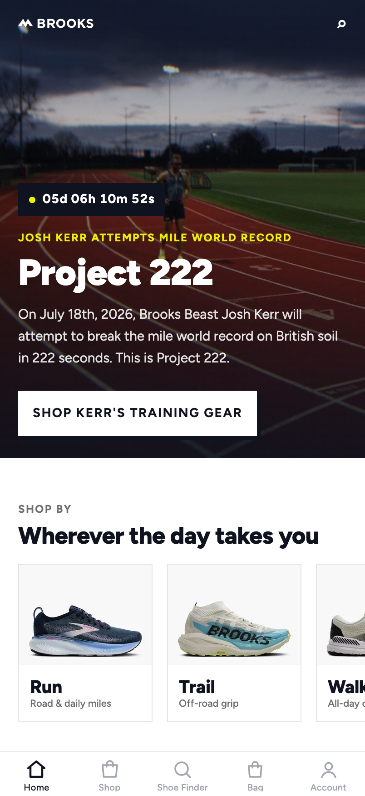
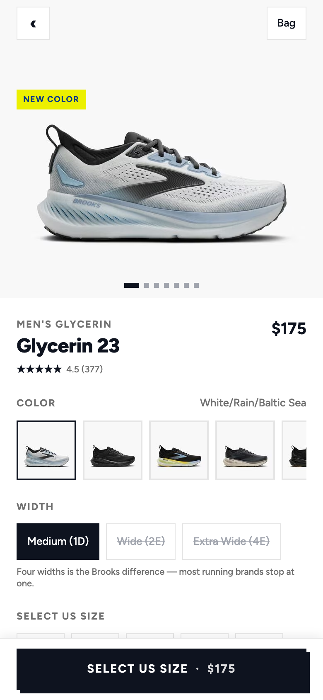

# Brooks Mobile App Prototype

Brooks is an exploration of what a best-in-class native shopping experience for
Brooks Running could feel like.

The repository will contain one app:

- **Expo app:** the primary deliverable—an exceptionally polished iOS and
  Android experience targeting Expo SDK 57 and Expo Go, with web support where
  practical.

## Current state (2026-07-13)

Research is **done**. The app is **built and verified**.

| | State |
|---|---|
| Design survey + Brooks brand system | ✅ Complete — [LLP 0003](./llp/0003-brooks-design-system.research.md) |
| Brooks API, sniffed and documented | ✅ Complete — [LLP 0002](./llp/0002-brooks-commerce-api.research.md) |
| Real catalog captured | ✅ 226 products, 821 colorways — `packages/catalog/catalog.json` |
| What Exact can do today | ✅ Complete — [LLP 0004](./llp/0004-building-on-exact.research.md) |
| **Expo app** | ✅ **Complete.** Home, Shop, PLP, PDP, Cart, Shoe Finder, live Search, Run Club login/account. 16-step browser E2E: all pass, zero console errors — [diary](./diaries/2026-07-13-expo-screens.md). |
| **Exact app** | ✅ **Complete** (web target, Contract). Home with live countdown, browse, search, PDP with variant selection, cart with real variant ids. 15-step agent-API E2E: all pass, zero console errors — [diary](./diaries/2026-07-13-exact-app.md). |

| Expo | |
|---|---|
|  |  |

More screenshots: `docs/expo-*.png` (PLP, cart, finder, live search) and
`docs/exact-*.png` (home, browse, detail, cart).

## The one thing to know about the data

[LLP 0002](./llp/0002-brooks-commerce-api.research.md) is the load-bearing
document. In short:

**brooksrunning.com is behind Akamai Bot Manager and returns `403` to every
non-browser HTTP client.** An app cannot call its product or cart APIs at all. Two
Brooks surfaces *are* open to a phone, and the architecture follows from that:

- **Live:** Constructor.io search (`src/data/constructor.ts`) and the Brooks image
  CDN, which resizes on demand — so the apps stream real Brooks photography.
- **Snapshotted:** products, prices, and per-size stock, captured by
  [`tools/harvest`](./tools/harvest) driving a real browser session, committed as
  `packages/catalog/catalog.json`.

The full journey — browse → product → variant → **add to a real Brooks cart** — was
driven end-to-end against the live endpoints and is documented. No order was placed.

## Running the Expo app

```sh
cd apps/expo
npm install
npx expo start          # then press i / a, or scan the QR code with Expo Go
npx expo start --web    # or run it in a browser
```

It boots to the Project 222 home screen with a live countdown to Josh Kerr's mile
world-record attempt on July 18, 2026, and real Brooks products throughout.
Search is live against Brooks's own Constructor.io index; everything else works
offline from the bundled snapshot.

## Running the Exact app

The Exact app follows `origin/main` of [ccheever/exact](https://github.com/ccheever/exact)
via a fresh clone at `~/projects/exact-main` (see `apps/exact/exact.links.json`).
One-time setup for that clone, if it doesn't exist yet:

```sh
git clone https://github.com/ccheever/exact ~/projects/exact-main
cd ~/projects/exact-main
git submodule update --init vendor/ibex
bun install
```

Then:

```sh
cd apps/exact
bun install
bun --bun run dev       # web app on http://127.0.0.1:8083
```

The dev server is the deliverable — Contract has no production web-build story
yet (LLP 0004). The agent surface lives at `http://127.0.0.1:8083/__exact/agent/`
while the app is open in a browser tab.

## Re-harvesting the catalog

```sh
npm --prefix tools/harvest install
npm --prefix tools/harvest run harvest   # slow, checkpointed, polite
npm --prefix tools/harvest run sync      # copy into apps/expo and apps/exact
```

`packages/catalog` is the source of truth. The copies under `apps/expo/src/data/`
are generated — edit the package, not the copy.

## Product scope

The apps combine native mobile-commerce patterns with the visual character and
content of the Brooks Running website, using real Brooks data for product
discovery, product details, variants, and a working add-to-cart journey.

The intended first experience mirrors the current commerce-focused website: the
Josh Kerr / Project 222 home feature, Men's, Women's, New Arrivals, Shoe Finder,
login, product shopping, and cart. Corporate and footer content can be added later.

Completing checkout, submitting payment, and placing an order are out of scope.

## Design goal

The Expo app should be more than a functional port of a website. It should feel
distinctively native, refined, responsive, and compelling enough to demonstrate to
Brooks executives why Expo is a strong foundation for their mobile app experience.

Its design direction blends patterns from a survey of excellent mobile
shoe-shopping apps ([LLP 0001](./llp/0001-mobile-shoe-commerce-design.research.md))
with the layout, brand language, content, and spirit of the Brooks website
([LLP 0003](./llp/0003-brooks-design-system.research.md)).

## Building as research

Most of the project is implemented by AI agents, which keep concise, durable
development diaries describing successful approaches, blockers, unexpected
difficulty, comparative friction, and ideas for improving Expo and Exact.

Entries live in [`diaries/`](./diaries/README.md), with one concise entry per
substantial implementation or research task.

## Project documentation

The project uses [Linked Literate Programming](https://github.com/ccheever/llp)
to keep code connected to design rationale.

- [LLP 0000: Brooks](./llp/0000-brooks.explainer.md) — product and system entry point
- [LLP 0001: Mobile Shoe Commerce Design Survey](./llp/0001-mobile-shoe-commerce-design.research.md) — benchmarks and rubric
- [LLP 0002: The Brooks Commerce API](./llp/0002-brooks-commerce-api.research.md) — **read this before touching data**
- [LLP 0003: Brooks Design System and Screen Patterns](./llp/0003-brooks-design-system.research.md) — brand tokens, voice, screen specs
- [LLP 0004: Building on Exact Today](./llp/0004-building-on-exact.research.md) — what Exact can and cannot do
- [AGENTS.md](./AGENTS.md) — working instructions for AI agents
